该项目是ICRA2020 AI Challenge I Hiter战队的Planning功能代码展示
# **1. 软件功能介绍**  
规划部分软件包括**机器人定位**和**机器人路径规划**两个功能。其中：
* **机器人定位**通过二维激光雷达数据作为输入。在有先验地图的情况下，输出机器人在地图坐标系中的位置姿态。
* **机器人路径规划**以机器人定位数据作为反馈、以计算机或用户定义的目标位置作为输入，在静态或动态环境中规划机器人的无碰撞平滑轨迹。并能够适应场景的尺寸误差及动态物体。  

# **2. 软件效果展示**  
定位算法十分轻量化，在i7-6700HQ平台上平均每帧计算时间约为1.5ms，对计算资源占用较少。在仿真环境下测试定位精度可以达到rmse误差8.1cm，绝对误差平均值7.3cm。仿真环境里程记和激光雷达添加了较大噪音，在瓷砖地面实际测试慢速（不打滑）情况下多次运行的轨迹基本重合。定位算法剔除映射在nearst map中概率较小的激光点，实现了动态物体剔除功能。  
机器人路径规划算法可以快速准确地规划出起始点到目标点的路径，经过多次测试，在地图上规划一次路径所需要的时间在0.2ms左右。在机器人检测到动态障碍物时，能够有效地规划出新路径避开该障碍物。能在已知己方另一辆机器人路径的前提下，规划出与之不冲突的路径。局部路径规划能使机器人与检测到的障碍物保持一定距离，从而顺利通过路径。机器人运动控制算法能够处理直线和圆弧子路径，对机器人的控制频率能够达到1ms。
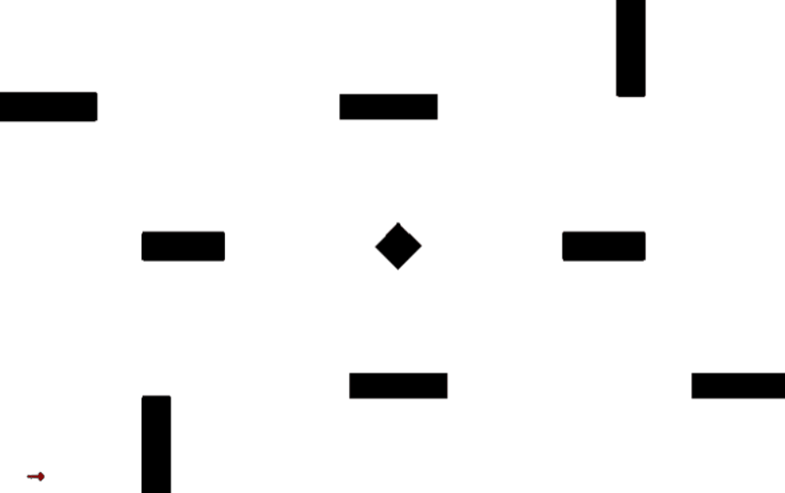   
<center>定位仿真 蓝色：groundtruth 红色：定位结果</center>  
   
<center>定位</center>  
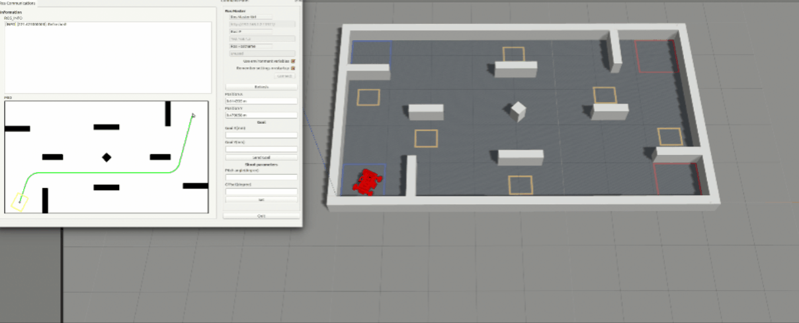   
<center>静态规划</center>  
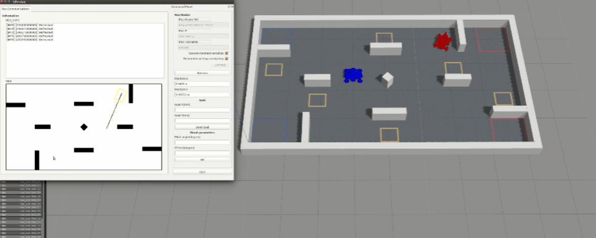   
<center>动态规划</center>  
   
<center>路径规划实验效果</center>  

# **3. 依赖工具，软、硬件环境**
**软件部分：**  
我们在Ubuntu16.04系统上测试运行了软件系统。机器人定位以及路径规划算法均在CPU上实时运行。  
**硬件部分：**  
传感器：激光雷达选用杉川 RPLIDAR A2 型号激光雷达，扫描范围 360°，扫描频率最高 15Hz，激光点 8000Hz   
计算平台：Intel i7-6700HQ  

### **localization程序部分：**  
localization部分的程序使用C++语言编写。能够在给定激光点输入、初始位姿大致范围以及地图先验的情况下，实现机器人的定位，输出机器人在地图坐标系下的xy坐标以及角度信息。  
### C++11编译器
代码在C++11环境下编译运行，在其他版本编译器上不能保证编译通过
### OpenCV  
我们使用OpencCV库来进行图像处理。OpenCV的安装和使用指导文件可以参考 http://opencv.org 。 实验使用OpenCV版本为 OpenCV 3.4.4
### Eigen  
我们使用了Eigen库的一些基本线性代数算法。Eigen库的下载安装和基本使用指导可以参考
http://eigen.tuxfamily.org 。 实验使用Eigen版本为 Eigen 3.3.5  
### PCL  
我们使用了PCL（Point Cloud Library）库用来实现激光雷达的二维点云配准以及点云处理等过程。PCL库的下载和使用方法可以参考 https://pointclouds.org/ 。
### Boost  
Boost是C++的标准拓展库。 
### MRPT  （选装）
MRPT是一款移动机器人开发工具，我们使用MRPT进行了机器人仿真环境下的数据采集。模拟机器人在地图下运动，用手柄操作，将带噪声的里程计信息、带噪声的点云信息以及groundtruth信息记录下来，为仿真实验提供数据。如需测试新的场景数据，请使用MRPT进行数据采集或另行设计数据接口。  
### **planning程序部分：**  
planning部分的程序使用C++语言编写，在ros环境下运行，通过gazebo软件获取实时的仿真数据。实现了机器人在静态或动态场景下，以定位数据作为输入的规划和导航运动。  
### ros-kinetic  
kinetic版本的ros环境，用来方便的实现软硬件间的通信。ros包含的各种开源软件以及接口也为程序设计和仿真提供了便利。  
### qt57creator-plugin-ros  
ros环境下的qt开发工具，用来实现软件的可视化效果。
### opencv3  
使用OpenCV实现一些基本的图像显示过程。OpenCV的安装和使用指导文件可以参考 http://opencv.org 。   
### glog  
glog是一款谷歌开源的日志管理工具。下载和安装方法可以参考 https://github.com/google/glog 。

# **4. 编译、安装方式**
克隆代码至本地仓库：
```git clone https://github.com/MengXiangBo/ICRA2020_RM_IHiter_Planning.git Planning```
执行如下代码：
 ```
cd localization
mkdir build
cd build
cmake -DCMAKE_BUILD_TYPE=Release ..
make -j4
 ```
代码执行完毕将会在Planning项目目录的bin文件夹下生成编译文件，在该路径下运行可执行文件即可测试算法demo  

```
cd planning
catkin_make
```  
上述程序执行完将会对planning算法进行编译，编译完成后在终端内执行：  
```
roslaunch mrobot_gazebo navdemo.launch
```
即可测试动态环境下的算法运行效果  

将src/icra_nav_src/trans_odom.cpp中改为#define TWO_ROBOTS 0后重新编译，编译完成后在终端执行：  
```
roslaunch mrobot_gazebo navdemo1.launch
```
即可测试静态环境下的算法运行效果  

# **6. 文件目录结构及文件用途说明**  
```
.
├── PIC // 存放文件图片
├── GIF // 存放gif图片
├── localization // 定位功能模块
│   ├── bin // 保存可执行文件
│   ├── map // 保存地图
│   ├── Dataset // 保存仿真数据集
│   ├── lib // 保存生成的库文件
│   ├── CMakeLists.txt
│   ├── laser_map.cpp 
│   ├── laser_map.h // 机器人激光射线地图映射模型及相关函数
│   ├── localization.cpp
│   ├── localization.h // 定位算法的调用接口及功能实现
│   ├── nnmap.cpp
│   ├── nnmap.h // 处理及生成nearest map的相关数据函数等
│   ├── particle_filter.cpp
│   ├── particle_filter.h // 粒子滤波类
│   └── test.cpp // demo测试用主文件
├── planning // 规划功能模块
│   ├── devel
│   ├── devel_isolated
│   ├── el
│   ├── el_isolated
│   ├── src
│   │   ├── CMakeLists.txt
│   │   ├── icra_nav // 导航功能包
│   │   │   ├── CMakeLists.txt
│   │   │   ├── include
│   │   │   ├── map.png
│   │   │   ├── msg // 自定义话题
│   │   │   ├── package.xml
│   │   │   ├── src // 导航源文件
│   │   │   │   ├── dynamic_obstacle.cpp // 动态避障节点
│   │   │   │   ├── findpath // 路径规划
│   │   │   │   ├── navigation // 运动控制
│   │   │   │   ├── nav_node.cpp // 导航总节点
│   │   │   │   ├── path_planning.cpp // 路径规划节点
│   │   │   │   ├── trans_odom1.cpp // 获取仿真环境中的定位（测试用）
│   │   │   │   └── trans_odom.cpp // 获取仿真环境中的定位（测试用）
│   │   │   └── srv // 自定义服务
│   │   ├── mrobot_gazebo // 仿真功能包
│   │   │   ├── CMakeLists.txt
│   │   │   ├── launch
│   │   │   ├── meshes // 机器人外观
│   │   │   ├── package.xml
│   │   │   ├── urdf // 机器人urdf文件
│   │   │   └── worlds // 比赛场地
│   │   ├── qtros // QT可视化功能包
│   │   │   ├── CMakeLists.txt
│   │   │   ├── include
│   │   │   ├── mainpage.dox
│   │   │   ├── package.xml
│   │   │   ├── resources
│   │   │   ├── rosgui.workspace.user
│   │   │   ├── src
│   │   │   └── ui
│   │   └── RoboRTS-ros // 官方开源接口
├── LICENSE // 开源协议
└── Readme.md // 说明文档
```

# **7. 原理介绍与理论支持分析**   
## 1. 定位  
&emsp;&emsp;机器人的全场定位功能是实现所有移动相关功能的基础。我们使用里程计配合激光点云ICP匹配的方法来实现机器人的全场定位。里程计虽然比较准确，但是有累计误差并且在长时间运行后，计算得到的x、y以及theta变化坐标系不与初始坐标系重合，因此即使作为ICP匹配初始化更新也会具有比较大的误差。
在此基础上增量式ICP方法在初始误差较大时容易产生局部次优解并且在运行过程中逐渐发散，即使使用比较耗时的全局地图匹配也可能由于估计不足而产生发散现象。与此对应的粒子滤波方法，有较高的鲁棒性，不容易丢失，但是比较耗时，往往需要对性能和精度进行取舍。  
&emsp;&emsp;为了实现高效鲁棒的定位效果，我们设计了以相邻帧间ICP，局部地图ICP，全局地图匹配为基础，辅之以粒子滤波重定位的高效定位方案。且能够去除动态点，实现机器人的稳定运行。算法运行过程如图所示：  
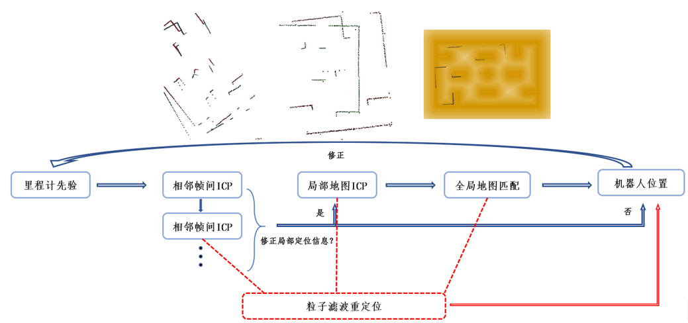  
<center>图7-1 定位算法流程</center>  
&emsp;&emsp;首先根据地图坐标点距离障碍物间的距离构建cost_map，每个坐标点的数值与距离最近障碍物表面的距离成反比。使用粒子滤波算法对机器人初始位姿进行估计，之后每一帧激光雷达数据都与前一帧或前几帧的数据进行SVD ICP匹配。当累计运行距离或时间超过某一阈值，自动进行局部地图匹配。将多个关联帧间的增量信息累计作为初始化位姿，与当前帧进行匹配以修正局部地图位姿估计误差。在以局部地图修正后的姿态作为初始值，在cost_map上进行全局位置匹配，获得绝对位置。全局匹配的过程激光点置信距离会随着机器人运动速度加快而增大，以适应高速运动引起的数据撕裂。过程中一旦检测到数据发散，立刻切换到粒子滤波重定位模式。  

&emsp;&emsp;随着运行时间的增长，里程计角度误差将逐渐超过全局ICP角度计算精度，在此情况下，通过全局匹配获得的绝对角度来修正里程计角度偏差。修正后的里程计增量输入重新与地图坐标系重合，保证了里程计先验信息输入的稳定性。  
&emsp;&emsp;经测算，在实际环境和仿真环境下，通过Intel i7-6700HQ运行算法平均计算时间可达1.8ms。图为关闭避障功能情况下机器人在实际场地中使用定位数据运行巡逻任务得到的定位效果图，可以看出，多次巡逻路径基本重合。巡逻时间5分钟，未触发重定位功能。  
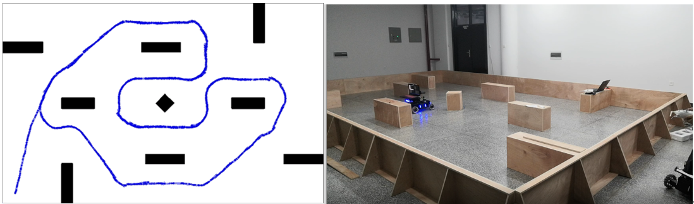  
<center>图7-2 定位算法效果</center>  

## 2. 运动规划  
### ***a.全局规划***  
多目标D*Lite算法基于D*Lite算法，并在计算移动代价时加入转角代价，用于搜寻地图上一条移动代价最小的可行路径。D*Lite算法采用反向搜索的方式，能够很好地处理机器人移动过程中出现的未知障碍物。其算法核心在于假设了未知区域都是自由空间，以此为基础，增量式地实现路径规划，通过最小化rhs值找到目标点到各个节点的最短距离。若前行过程中发现障碍物则将障碍物所对应环境地图位置设置为障碍物空间，并再以之为起点利用“路径场”信息重新规划出一条路径来。此时不仅更新规划路径的节点数据，也要更新智能体遍历过的节点。  
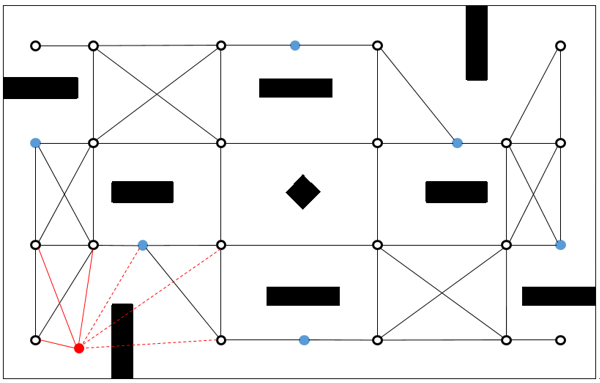  
<center>图7-3 路径点</center>   
在地图上选取若干路径点作为全局路径规划的中间点，如图3所示，各个路径点用黑色空心圆圈表示，（其中包括加成/惩罚区域，用蓝色实心圆圈表示）每个路径点与邻近点之间可以直线移动，机器人运行过程中，给定机器人的路径规划终点，并从定位系统中获取机器人的当前位置作为起点。每次执行规划任务时，将起点和终点加入到路径点的集合中，并通过直线与障碍物的碰撞检测来确定起点和终点的邻点，红色实心圆圈为起点或终点，红色实线为通过碰撞检测的路径，红色虚线为未通过碰撞检测的路径，将红色实线加入到可行边的集合中。  
用路径中相邻直线的角度值来评价平滑度，角度越小则越平滑，在原有的计算式中加入平滑度计算，为:  

<p align="center">  

  
</p>  
$$rhs(u) = \min \limits_{s' \in Succ(u)} (c(u.s') + g(s') + \lambda \theta (s'))$$  
通过增加权重系数，将多目标问题转化为单目标问题，在原有的算法框架下进行路径规划，通过调整权重系数的大小，可以改变路径对平滑度的倾向程度。  
在生成一条可行路径后，对路径点进行简化，删除一些不必要的路径点。首先，对于共线的多个点，保留两端的点，删除中间点；其次，在路径点序列中，如果第 个点与第 个点之间的直线路径是无碰的，则删除第 个路径点。采用的是圆弧过渡对折线路径进行平滑处理，可以保证平滑后的路径是安全的。  
在检测到动态障碍物后，根据其位置判断是否阻挡下一段可行路径，若阻挡，则利用原有的路径场更新周围节点。 
  
<center>图7-4 全局规划</center>  

### ***b. 局部规划***
局部路径规划采用是人工势场法的思路，将全局规划出的路径作为参考路径，参考路径对机器人有“引导力”，而机器人通过激光雷达检测出的障碍物（静态障碍物和机器人）对机器人具有“排斥力”，当机器人距离障碍物距离大于设定的距离时，“排斥力”消失。
黑色实线是由激光雷达采集的数据拟合出的障碍物轮廓线，绿色实线是机器人的轮廓，红色实线是距离机器人轮廓过近的障碍物，此时，障碍物会对机器人产生一个“排斥力”，方向垂直于障碍物表面。  
$$F_i =\begin{cases} {\frac{{r_0^2{F_0}}}{{r_i^2}}},  & {{r_i} \ge r}  \\ F_0, & {{r_i} < r} \end{cases}$$  
其中，$F_i$为排斥力，$r_i$为机器人边缘与障碍物的距离，$F_0$为最大排斥力，$r_0$为有效距离。
如果有多个障碍物对机器人产生影响，则求多个“排斥力”的加权平均数。  
$$F = \sum\limits_i {{\alpha _i}{F_i}} $$  
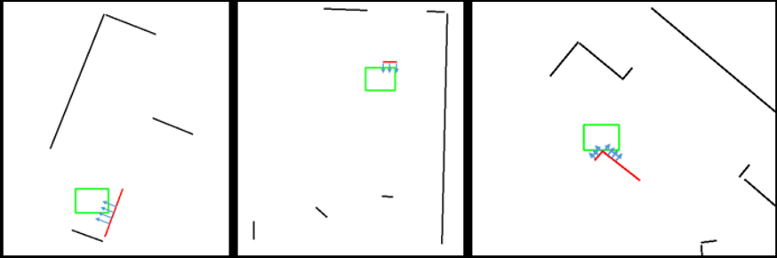  
<center>图7-5 局部规划</center>  

### ***c. 多机器人路径规划***
进行多机器人路径规划时，根据任务的优先级，设定主从机器人，主机器人的路径规划仍然按照单机器人来进行，从机器人将主机器人看作动态障碍物，不同于敌方机器人这一类动态障碍物，主机器人的运动是已知的，故可以将主机器人的路径作为约束路径来实现从机器人的规划。  
在提前知道主从机器人规划的路径后，预测两个机器人是否会相撞，若在某一点附近相撞，则修改从机器人速度或者将相撞点附近视为不可行，通过全局规划重新规划路径。  
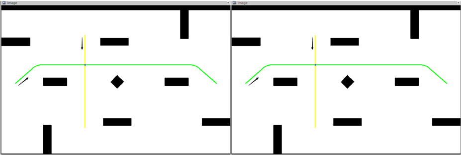  
<center>图7-6 多机规划</center>    

### ***d.运动控制原理：***
1.速度控制  

将机器人速度分为沿路径速度和垂直路径速度，在沿路径方向，采用梯形规划+加速度前馈的控制方式，使前进速度平滑。在垂直路径方向，采用带死区的有限积分PID。  
  
<center>图7-7 速度规划</center>    
2.直线和圆弧的计算  

S是起点，E是终点，P是当前位置， $\Delta L$是横向距离，L是纵向距离，$\alpha$是导航角。需要根据三个位置来计算当前的横向和纵向距离，以此来进行梯形规划和PID计算。
在直线中，$L|SE| = |SE \bullet PE|$ ,$\Delta L = |SE \times PE|$  
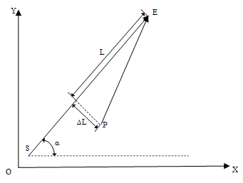  
在圆弧中，O'是圆心，$L = |O'S|\arccos \frac{{|OP \bullet OE|}}{{|OP||OE|}}$，$\Delta L = |O'P| - |O'S|$
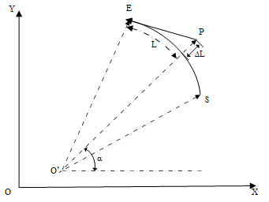  

# **8.数据流图及软件框图**  
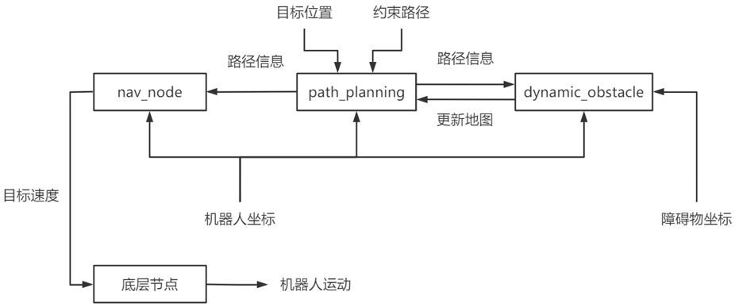  
<center>图8-1 运动规划数据流</center>   
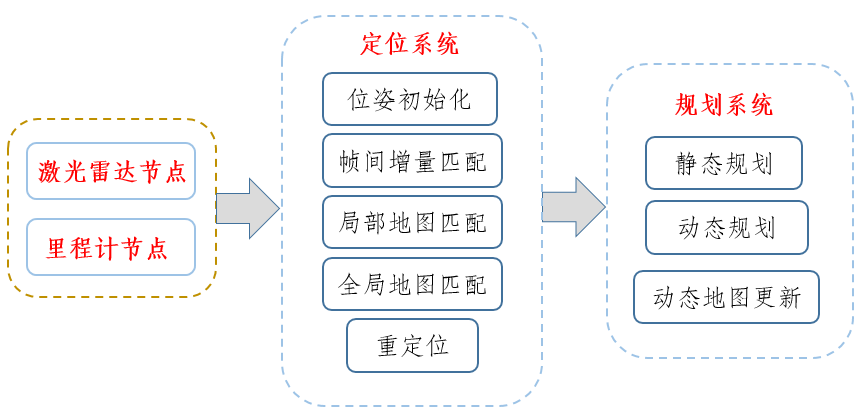  
<center>图8-2 Planning软件框图</center>   
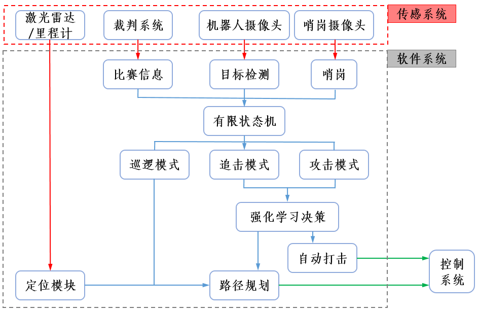  
<center>图8-3 总数据流框图</center>   